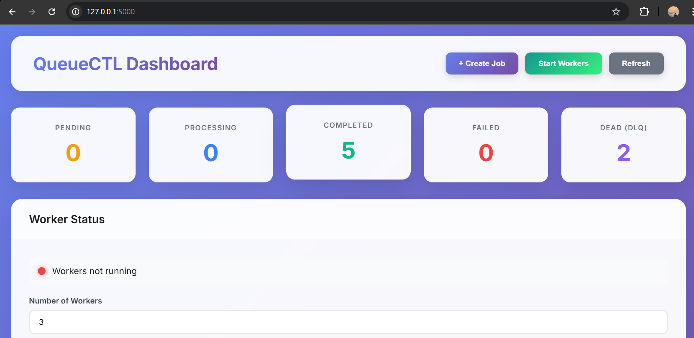
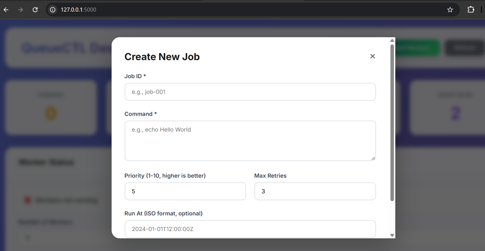
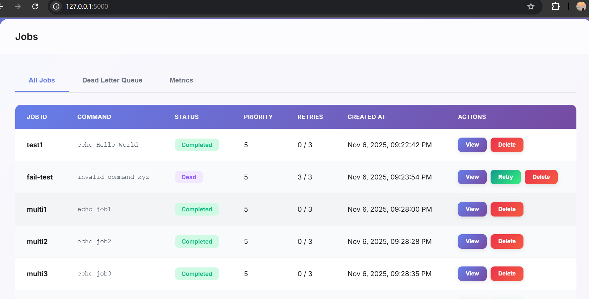
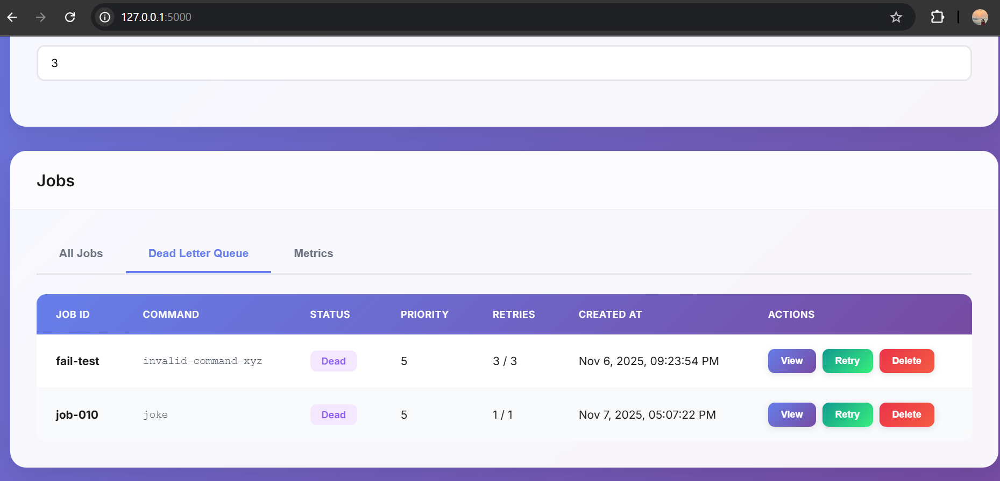
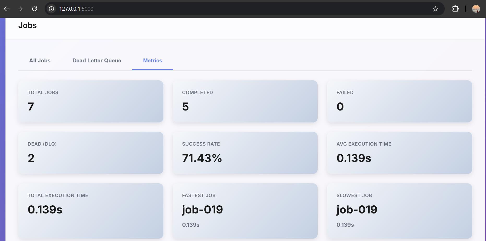
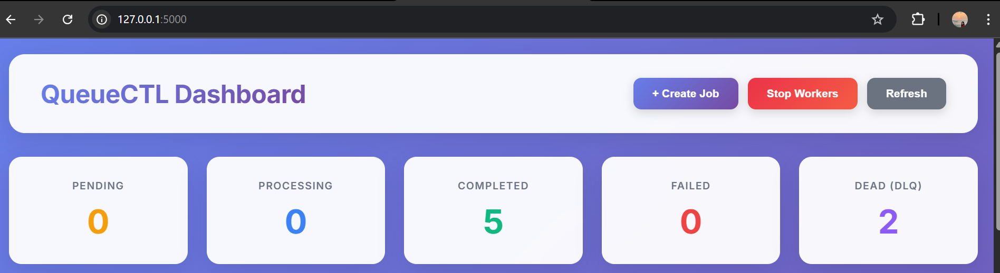

# QueueCTL

A command-line job queue system built for the Software Developer Internship Assignment. This system allows you to enqueue background jobs, process them using multiple workers, and automatically retry failed jobs with exponential backoff. Jobs that exceed the maximum retry attempts are moved to a Dead Letter Queue for manual review.

## Overview

QueueCTL is a lightweight job queue implementation that handles asynchronous task processing. Jobs are stored persistently in JSON files, ensuring they survive system restarts. The system supports priority-based job processing, scheduled execution, output logging, and provides both CLI and web dashboard interfaces for monitoring and management.

## Features

- **Job Enqueueing**: Add jobs to the queue via CLI with JSON configuration
- **Worker Management**: Run multiple workers in parallel to process jobs concurrently
- **Automatic Retries**: Failed jobs are automatically retried with exponential backoff
- **Dead Letter Queue**: Jobs that fail after maximum retries are moved to DLQ
- **Priority Queues**: Jobs with higher priority values are processed first
- **Scheduled Jobs**: Schedule jobs to run at specific times using ISO 8601 timestamps
- **Output Logging**: Capture and store stdout and stderr for each job execution
- **Execution Metrics**: Track execution times, success rates, and job statistics
- **Web Dashboard**: Monitor jobs, workers, and metrics through a web interface
- **Configuration Management**: Adjust retry counts, backoff times, and other settings

## Setup

### Prerequisites

- Python 3.7 or higher
- pip package manager

### Installation

Clone the repository and set up the environment:

```bash
git clone https://github.com/shriyasanthosh/queuectl.git
cd queuectl
python -m venv venv
```

Activate the virtual environment:

**Windows:**
```bash
venv\Scripts\activate
```

**Mac/Linux:**
```bash
source venv/bin/activate
```

Install dependencies:

```bash
pip install -r requirements.txt
pip install -e .
```

After installation, the `queuectl` command will be available from anywhere in your terminal.

## Usage

### Basic Commands

**Enqueue a job:**
```bash
queuectl enqueue '{"id":"job1","command":"echo Hello World"}'
```

**Start workers:**
```bash
queuectl worker start --count 2
```

**Check queue status:**
```bash
queuectl status
```

**List all jobs:**
```bash
queuectl list
```

**Stop workers:**
```bash
queuectl worker stop
```

### Advanced Features

**Job with priority:**
```bash
queuectl enqueue '{"id":"important","command":"process.sh","priority":8}'
```

Priority values range from 1 to 10, with higher numbers indicating higher priority. Jobs with the same priority are processed in FIFO order based on creation time.

**Scheduled job:**
```bash
queuectl enqueue '{"id":"backup","command":"backup.sh","run_at":"2024-12-01T10:00:00Z"}'
```

The `run_at` field accepts ISO 8601 formatted timestamps. The job will not be picked up by workers until the specified time.

**View job output:**
```bash
queuectl job output job1
queuectl job output job1 --stdout
queuectl job output job1 --stderr
```

**View execution metrics:**
```bash
queuectl metrics
```

This displays statistics including total jobs, success rate, average execution time, and fastest/slowest job information.

### Dead Letter Queue

Jobs that fail after exhausting all retry attempts are moved to the Dead Letter Queue:

```bash
queuectl dlq list
```

To retry a job from the DLQ:
```bash
queuectl dlq retry job5
```

This resets the job's state to pending and moves it back to the main queue.

### Configuration

View current configuration:
```bash
queuectl config show
```

Update configuration values:
```bash
queuectl config set max-retries 5
queuectl config set backoff-base 3.0
queuectl config set worker-poll-interval 2.0
queuectl config set job-timeout 600
```

Configuration changes are persisted to `config.json` and apply to all new jobs.

### Web Dashboard

Start the web server:
```bash
queuectl web
```

The dashboard will be available at `http://127.0.0.1:5000`. From the web interface, you can:
- Create new jobs
- View all jobs and their status
- Start and stop workers
- Monitor execution metrics
- Manage the Dead Letter Queue
- View job details and output

#### Dashboard Overview



The main dashboard displays job statistics, worker status, and provides quick access to all features.

#### Creating Jobs



The web interface allows you to create jobs with priority, retry settings, and scheduled execution times.

#### Jobs Table View



View all jobs in a comprehensive table with status badges, priority indicators, and action buttons.

#### Dead Letter Queue



Jobs that have exhausted all retry attempts are displayed in the Dead Letter Queue, where they can be reviewed and retried if needed.

#### Execution Metrics



The metrics tab provides detailed statistics including success rates, execution times, and performance analytics.

#### Worker Management



Monitor worker status and control worker processes directly from the web interface.

## Architecture

### Job Lifecycle

Jobs progress through the following states:

1. **pending**: Job is waiting to be picked up by a worker
2. **processing**: Job is currently being executed by a worker
3. **completed**: Job finished successfully
4. **failed**: Job failed but has retries remaining
5. **dead**: Job exceeded maximum retries and was moved to DLQ

The typical flow is: `pending → processing → completed`. For failed jobs: `pending → processing → failed → (retry) → processing → completed` or `failed → dead` if retries are exhausted.

### Retry Mechanism

When a job fails, the system calculates a retry delay using exponential backoff. With the default `backoff_base` of 2.0:
- First retry: 2 seconds delay
- Second retry: 4 seconds delay
- Third retry: 8 seconds delay
- After max retries: moved to DLQ

The retry delay is calculated as `backoff_base ^ attempts`.

### Data Persistence

All job data is stored in JSON files:
- `jobs.json`: Contains all job information including state, attempts, output, execution time, and metadata
- `config.json`: Stores configuration settings

This file-based approach ensures jobs persist across system restarts. If workers are stopped and restarted, pending jobs remain in the queue.

### Worker Processing

Workers run as threads within the same process. Each worker follows this cycle:

1. Polls for available jobs (checks pending and failed jobs ready for retry)
2. Atomically claims a job by marking it as processing
3. Executes the job command using subprocess
4. Captures stdout, stderr, and execution time
5. Updates job state based on execution result
6. Saves job data to storage
7. Repeats the cycle

Multiple workers can run concurrently. File locking ensures thread-safe access to job storage, preventing race conditions and data corruption.

### Priority Processing

Jobs are sorted by priority (descending) and then by creation time (ascending). This means:
- Higher priority jobs are always processed first
- Among jobs with the same priority, older jobs are processed first

### Scheduled Jobs

Jobs with a `run_at` timestamp are filtered during job selection. Workers only pick up scheduled jobs after the specified time has passed. This allows for delayed execution and scheduled tasks.

## Design Decisions

**JSON File Storage**: I chose JSON files over a database for simplicity and ease of debugging. This works well for single-machine deployments but may not scale to high-throughput distributed systems.

**Threading Model**: Workers run as threads rather than separate processes. This simplifies shared state management and debugging, though it's limited by Python's Global Interpreter Lock for CPU-intensive tasks.

**File Locking**: Thread-safe file operations use Python's threading locks. This works reliably for single-machine scenarios but would need distributed locking for multi-machine deployments.

**Persistent Storage**: All job data is written to disk immediately. This ensures no data loss on restart but adds slight I/O overhead compared to in-memory systems.

**Exponential Backoff**: The retry strategy uses exponential backoff with a configurable base. This is a standard approach that prevents overwhelming the system with immediate retries while ensuring eventual retry attempts.

**Dual Interface**: Both CLI and web dashboard are provided. The CLI is better for automation and scripting, while the web dashboard offers better visualization and monitoring capabilities.

## Testing

### Manual Testing

Test basic job execution:
```bash
queuectl enqueue '{"id":"test1","command":"echo Test"}'
queuectl worker start --count 1
queuectl status
queuectl worker stop
```

Test retry mechanism:
```bash
queuectl enqueue '{"id":"fail1","command":"exit 1","max_retries":2}'
queuectl worker start --count 1
# Observe the job retry multiple times, then move to DLQ
```

Test Dead Letter Queue:
```bash
queuectl dlq list
queuectl dlq retry fail1
```

Test priority ordering:
```bash
queuectl enqueue '{"id":"low","command":"echo Low","priority":1}'
queuectl enqueue '{"id":"high","command":"echo High","priority":10}'
queuectl worker start --count 1
# High priority job should execute first
```

Test scheduled jobs:
```bash
queuectl enqueue '{"id":"scheduled","command":"echo Scheduled","run_at":"2024-12-01T12:00:00Z"}'
queuectl worker start --count 1
# Job will not execute until the specified time
```

## Project Structure

```
queuectl/
├── queuectl/
│   ├── __init__.py       # Package initialization
│   ├── cli.py            # CLI command definitions
│   ├── worker.py         # Worker and WorkerManager classes
│   ├── storage.py        # JobStorage for JSON persistence
│   ├── executor.py       # JobExecutor for command execution
│   ├── config.py         # Configuration management
│   ├── models.py         # Job model and JobState enum
│   ├── web.py            # Flask web application
│   └── templates/
│       └── index.html    # Web dashboard template
├── setup.py              # Package setup configuration
└── requirements.txt      # Python dependencies
```

**cli.py**: Defines all command-line interface commands using Click framework. Handles job enqueueing, worker management, status queries, DLQ operations, configuration, and metrics.

**worker.py**: Contains the Worker class that processes jobs and the WorkerManager that coordinates multiple workers. Implements the main processing loop, job claiming logic, and retry handling.

**storage.py**: Manages persistent storage of jobs in JSON format. Provides thread-safe read/write operations, job querying by state, priority sorting, and scheduled job filtering.

**executor.py**: Executes job commands using subprocess. Captures stdout, stderr, execution time, and handles timeouts and errors.

**config.py**: Manages application configuration stored in JSON. Provides get/set operations with validation and default values.

**models.py**: Defines the Job class and JobState enum. Handles job state transitions, retry calculations, and serialization.

**web.py**: Flask application providing REST API endpoints and web dashboard. Handles job CRUD operations, worker management, metrics, and DLQ operations.

## Author

**Author:** Shriya santhosh  
Created for Backend Developer Internship Assignment Submission.
